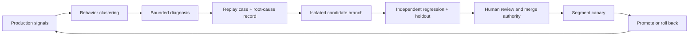

# Controlled Improvement Agent

## Purpose

Turn production signals into reviewable change candidates without allowing the agent to change the systems that judge, approve, or deploy its work.



## Exact configuration baseline

Bind every observed run and proposed change to the complete effective release graph: workflow topology, model route, prompt, harness, context and guardrail policy, admitted skill and capability digests, tool and MCP contracts, evaluator, runtime, permissions, resource budgets, environment, and applicable data and policy revisions. Use the existing agent-system, behavior-bundle, capability-manifest, evaluation-report, and solution-release records rather than introducing a parallel factory manifest. A partial baseline cannot support a causal improvement claim.

## Authority separation

| Plane | Agent may | Agent MUST NOT |
| --- | --- | --- |
| Evidence | Read redacted traces, metrics, incidents, and user corrections | Read credentials, hidden evaluation answers, or unrestricted customer payloads |
| Diagnosis | Cluster behavior and propose a causal failure record | Label correlation as root cause without replay evidence |
| Change | Write to an isolated branch or candidate artifact store | Modify production, protected branches, policies, registries, or release approvals |
| Evaluation | Request approved suites and consume signed results | Edit tests, graders, fixtures, thresholds, reference answers, or pass signals |
| Delivery | Prepare diff, migration, canary, rollback, and review packet | Approve, merge, deploy, expand autonomy, or suppress alerts |

Use distinct workload identities for evidence read, candidate write, evaluator execution, and deployment. No principal may span candidate author and release decision authority.

## Diagnostic record

```text
diagnostic_id
signal_window + affected release/route/segment
first_divergent_step
violated_invariant
failure_class
owning_layer
causal_evidence
counterevidence
world/policy/data/component revisions
replay_case_ids
customer and security impact
confidence + unresolved alternatives
owner + severity + due date
```

Failure classes: `context`, `retrieval`, `data_quality`, `model_behavior`, `tool_contract`, `authorization`, `state`, `effect_unknown`, `postcondition`, `evaluation`, `runtime`, `capacity`, `cost`, `human_interface`, `adoption`, `unknown`.

## Candidate change packet

- Before/after release-graph digests for workflow topology, model route, prompt, context policy, admitted skills and capabilities, tools and MCP servers, guardrail, evaluator, runtime, permissions, budgets, environment, data, policy, and schema.
- Affected workflows, segments, identities, data classes, effect classes, and external dependencies.
- Diagnostic and replay-case links.
- Threat-model delta and new negative tests.
- Compatibility and migration plan.
- Independent evaluation report, including unchanged holdout and contamination attestation.
- Canary population, duration, success/rollback criteria, and accountable owner.
- Rollback artifact and last-known-good digest.
- Required reviewers and segregation-of-duties check.

## Scored-observation admission

A scorer is a governed evaluator, not a trusted narrator. Record its claim, eligible run population, sampling and exclusion policy, trace and human-interaction inputs, rubric, version and digest, label or reference authority, uncertainty, calibration, cost, disagreement and adjudication path, and unavailable or invalid-result behavior. Minimize and classify trace, PR, task-tracker, reviewer, and correction data before scoring.

A configuration benchmark MUST compare the current and candidate release graphs on the same representative tasks, frozen world and policy revisions, resource ceilings, scorer versions, trial rules, and acceptance criteria. Preserve per-case results, failed and excluded cases, uncertainty, safety slices, and an unchanged holdout. Select on the workload-specific Pareto frontier across accepted-outcome quality, reliability, safety, latency, reviewer effect, and full cost; an aggregate score or apparent winner cannot hide a consequential regression.

## Expert-feedback admission

An expert correction MAY open a diagnostic record, replay case, proposed benchmark, and isolated candidate change. The correction MUST retain the triggering interaction, affected claim or behavior, source and policy revisions, label author, accountable owner, independent approver, disagreement and adjudication path, classification, contamination treatment, and review date. Usage frequency, seniority, or a generated pull request does not make the correction ground truth.

Candidate-generation automation MUST NOT modify the protected benchmark, grader, threshold, holdout, CI result, approval, merge, deployment, or rollback evidence that judges its own change (`EVA-002`, `OPS-007`, `REL-003`). The bounded [Bridgewater PAT field report](../research/2026-08-27--bridgewater-pocket-analyst-tool.md#r26-76) is an implementation lead for converting expert feedback into candidate benchmarks and changes; it is not evidence that autonomous self-improvement is safe or complete.

## State machine

```text
signal_detected
  -> cluster_confirmed
  -> diagnosis_replayed
  -> candidate_created
  -> independent_eval_requested
independent_eval_requested -> eval_failed [terminal]
independent_eval_requested -> eval_passed -> review_rejected [terminal]
eval_passed -> review_approved -> canary_started
canary_started -> rolled_back [terminal]
canary_started -> canary_passed -> promoted -> monitored [terminal]
```

Every terminal path emits a reason. No failed, rejected, or rolled-back path reaches promotion; a new attempt starts a new candidate with a new digest and evaluation record. An evaluation failure cannot be converted into a pass by changing the threshold inside the same change packet.

## Release tests

- Candidate identity cannot write evaluator, CI, policy, approval, protected branch, registry, or deployment resources.
- A production incident produces a replay case before closure (EVA-004).
- The first divergent step and violated invariant reproduce in the frozen world.
- Candidate passes the incident case, unchanged regression suite, isolated holdout, safety slices, and resource budgets.
- Evaluator and decision principals differ from the candidate author.
- Changed model/prompt/tool/context/guardrail routes are evaluated independently (OPS-007).
- Scorer configuration, sample, rubric, cost, label authority, and disagreement path are versioned and reviewable.
- Current and candidate configurations run against identical tasks, worlds, policies, budgets, scorers, and trial rules.
- Canary can be stopped by kill switch, automatically rolls back on declared criteria, and verifies the restored digest.
- Promotion cannot occur from an agent-authored natural-language success claim.

Evidence leads: R26-17, R26-20, R26-25, R26-46, R26-51, R26-55, [R26-76](../research/2026-08-27--bridgewater-pocket-analyst-tool.md#r26-76), and [R26-81](../research/2026-08-28--warp-self-improving-software-factories.md#r26-81).

## Controls

`EVA-002`, `EVA-004`, `EVA-006`, `IAM-001`, `IAM-002`, `OPS-001`, `OPS-002`, `OPS-003`, `OPS-005`, `OPS-007`, `REL-003`, `SEC-004`
