# Invoice Exception Reference System

Start with the [complete worked engagement](engagement/README.md) if you want to see why this boundary exists, what the economics would have to prove, and why the current evidence supports review-only shadow work rather than deployment. The runtime below is one slice of that engagement—not the whole customer outcome.

## Objective

The optional [document review lab](document-review/README.md) adds an upstream source-to-draft exercise, live-model adapter, and operator correction surface. The [policy retrieval lab](retrieval-evaluation/README.md) separately tests ranking, permissions, freshness, citation integrity, conflict surfacing, and abstention before answer generation. Both are intentionally disconnected from the posting tools below.

```text
invoice exception event
  -> gather ledger/vendor/policy evidence
  -> propose resolution
  -> validate invariants
  -> authorize and stage
  -> approve exact proposal digest
  -> reauthorize and commit idempotently
  -> reconcile any effect-unknown timeout
  -> read back ledger state
  -> completed receipt | compensation + incident
```

## Architecture

```mermaid
flowchart LR
    E["Exception event"] --> W["Durable workflow"]
    W --> R["Read tools"]
    R --> O["Invoice ontology"]
    O --> M["Resolution proposal"]
    M --> V["Schema + invariant validation"]
    V --> P["Policy decision point"]
    P --> S["Stage resolution"]
    S --> A["AP approver"]
    A --> C["Commit resolution"]
    C --> B["Ledger readback"]
    B --> Q["Effect receipt"]
```



## Artifact map

| Artifact | Path |
| --- | --- |
| End-to-end worked engagement | [`engagement/README.md`](engagement/README.md) |
| Field evidence and reframe | [`engagement/field-evidence.md`](engagement/field-evidence.md) and [`engagement/engagement-reframe.json`](engagement/engagement-reframe.json) |
| Value and mechanism decisions | [`engagement/value-case.md`](engagement/value-case.md) and [`engagement/intelligence-selection.md`](engagement/intelligence-selection.md) |
| Adoption, handoff, and evidence review | [`engagement/adoption-and-handoff.md`](engagement/adoption-and-handoff.md) and [`engagement/service-review.md`](engagement/service-review.md) |
| Source-to-draft review practice | [`document-review/README.md`](document-review/README.md) |
| Policy retrieval evaluation practice | [`retrieval-evaluation/README.md`](retrieval-evaluation/README.md) |
| Workflow charter | [`workflow-charter.json`](workflow-charter.json) |
| Agent design | [`agent-system.json`](agent-system.json) |
| Ontology | [`ontology.json`](ontology.json) |
| Behavior bundle | [`behavior-bundle.json`](behavior-bundle.json) |
| Read-invoice tool | [`tools/read-invoice.json`](tools/read-invoice.json) |
| Retrieve-policy tool | [`tools/retrieve-policy.json`](tools/retrieve-policy.json) |
| Stage-resolution tool | [`tools/stage-resolution.json`](tools/stage-resolution.json) |
| Commit-resolution tool | [`tools/commit-resolution.json`](tools/commit-resolution.json) |
| Readback tool | [`tools/readback-invoice-effect.json`](tools/readback-invoice-effect.json) |
| Candidate capability manifests | [`capabilities/`](capabilities/) |
| Authorized-flow eval | [`evals/authorized-commit.json`](evals/authorized-commit.json) |
| Unauthorized-flow eval | [`evals/unauthorized-write.json`](evals/unauthorized-write.json) |
| Retry/idempotency eval | [`evals/duplicate-retry.json`](evals/duplicate-retry.json) |
| Revision-drift retry eval | [`evals/revision-drift-retry.json`](evals/revision-drift-retry.json) |
| Injection eval | [`evals/prompt-injection.json`](evals/prompt-injection.json) |
| Threat model | [`threat-model.json`](threat-model.json) |
| Authorization policy | [`authorization-policy.mjs`](authorization-policy.mjs) |
| Executable loop | [`reference-loop.mjs`](reference-loop.mjs) |
| Behavioral tests | [`reference-loop.test.mjs`](reference-loop.test.mjs) |
| Replay world fixture | [`invoice-world-fixture.mjs`](invoice-world-fixture.mjs) |
| Executable eval runner | [`run-evals.mjs`](run-evals.mjs) |
| Independent grader | [`evaluation-grader.mjs`](evaluation-grader.mjs) |
| Measured evaluation output | [`evaluation-output.json`](evaluation-output.json) |
| Evaluation report | [`evaluation-report.json`](evaluation-report.json) |
| Review-only solution release | [`solution-release.json`](solution-release.json) |
| Trace-event contract | [`../../schemas/trace-event.schema.json`](../../schemas/trace-event.schema.json) |
| Effect-receipt contract | [`../../schemas/effect-receipt.schema.json`](../../schemas/effect-receipt.schema.json) |

## Execute

```bash
npm test
```

## Effect invariants

- `resolution_commits(tenant_id, business_operation_id) <= 1`
- `runtime.release_digest == admitted_solution_release.digest` before reads and effects
- `commit.invoice_revision == current_invoice_revision`
- `commit.proposal_digest == approval.proposal_digest`
- `commit.policy_revision == current_policy_revision`
- `caller.tenant_id == invoice.tenant_id`
- `current_caller_scopes` and `current_policy_revision` are checked at each data/effect boundary
- the [data-context manifest](data-context-manifest.json) separates operational, policy, evaluation, and telemetry uses and binds the agent's exact source projection, preparation, quality, output, and drift contract
- `committed == true` only after source-of-truth readback
- `effect_unknown` is reconciled before retry or completion
- `completed == true` only after trusted receipt and readback-attestation verification
- `steps`, `wall_time`, and `cost` stay within the declared runtime budget
- `model_access(credentials) == false`

## Scope of the example

The worked engagement demonstrates how field evidence narrows a sold automatic-posting promise into a reviewer-controlled slice, then connects that decision to a value forecast, mechanism selection, controlled-write implementation, evaluation, adoption plan, handoff gap, and next-gate review. The runtime demonstrates exact release admission, contracts, current policy and identity checks, approval binding, duplicate-safe execution, effect-unknown recovery, signed service evidence, source-of-truth verification, runtime budgets, adversarial cases, and privacy-minimized trace evidence.

Every field source, role, value, and decision is a synthetic fixture. The solution release remains `review`, capability manifests remain `candidate`, signatures and registry records use non-production example identities, and evaluations run in an ordinary host process rather than an isolated production sandbox. The example does not claim authenticated production provenance, representative customer observation, customer adoption, realized business value, deployment approval, or completed handoff. Its [evidence review](engagement/service-review.md) keeps those gaps open.

## Teaching-to-production boundary

The in-memory ledger, vendor master, policy service, tenant context, workflow state, receipts, and traces make the controlled-write contract inspectable; they are not substitutes for durable state, target identity and authorization, row- or field-level access controls, immutable or tamper-evident audit retention, concurrency control, migration, reconciliation, load, recovery, or restricted-environment promotion. Use [Enterprise Integration and Scale Reality](../../library/17-enterprise-integration-and-scale-reality.md) and the [production service readiness record](../../templates/production-service-readiness.md) to replace each convenience with target-appropriate evidence. Do not translate this fixture line for line into a deployment.
