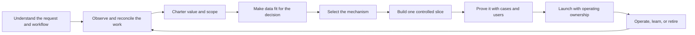

# The Applied AI Field Guide

> From a real workflow to measurable, operated value.

This is the shared mental model for turning an AI request into a useful, supportable change to real work. If you need the next move now, start with the [five-minute field guide](field-guide-in-five-minutes.md). Come back here for the full loop.

The **Guide** explains the method. The [Handbook](../playbooks/README.md) supports delivery. The [Engineering Kit](../templates/README.md) provides contracts, controls, code, and tests. They are three depths of one method.

**Reading time:** about 15 minutes. This is guidance, not production approval or a substitute for a target organization's policy, security, architecture, or risk review.

## 1. What the delivery team is responsible for

The team turns an ambiguous operating problem into a supported software service that improves an accepted outcome. That takes several kinds of work:

| Responsibility | Question |
| --- | --- |
| Discovery | Where do work, judgment, delay, risk, and value actually occur? |
| Product | What should change for users, and what should remain human, local, or manual? |
| Engineering | What is the smallest reliable system that can improve the workflow? |
| Operation | Can the team prove the result, support it, change it, and eventually retire it? |

Applied-AI engineers build and test the behavior. Product and workflow owners decide which work should change. Platform, data, security, and service teams own their boundaries. An FDE connects these responsibilities in an unfamiliar environment. Record the actual decision rights and missing expertise.

The output is an **owned change to real work** with a verifier, bounded authority, full-cost case, operating team, and exit path.

Tokens are an input and autonomy is a design choice. The product is an independently accepted outcome.

## 2. The operating loop

The repository uses one canonical lifecycle:



| Stage | Decision evidence |
| --- | --- |
| Understand the request and workflow | Exact requested outcome, source revision, intended users, current path, and decision boundary |
| Observe and reconcile the work | Representative cases, exceptions, roles, competing claims, and a safe fallback |
| Charter value and scope | Baseline, accepted outcome, verifier, population, value hypothesis, guardrails, and risk ceiling |
| Make data fit for the decision | Source authority, quality thresholds, preparation lineage, output ownership, cost, and failure behavior |
| Select the mechanism | A comparison of software, optimization, ML, retrieval, model, agent, and human routes |
| Build one controlled slice | Real interfaces, state, work surface, failure behavior, adoption plan, and bounded effect |
| Prove it with cases and users | Replayable cases, user evidence, cost, limitations, and rollback criteria |
| Launch with operating ownership | Compatible release, authority, runbooks, bounded rollout, exercised recovery, and accepted retained or transferred responsibility |
| Operate, learn, or retire | Accepted outcomes, value, adoption, reliability, safety, cost, ownership, and field learning |

Stopping or narrowing weak work is a valid result. A sponsor, model score, renewal, launch, or usage number cannot average away a failed value, authority, safety, ownership, or production gate.

## 3. Observe the work before designing the system

Requests arrive as tickets, mandates, statements of work, incidents, or live-service changes. Preserve the request and its source, then follow recent cases through the workflow.

Monday morning, the sponsor says invoice exceptions should post automatically. By lunch, the queue owner has shown you the approval step and the controls manager has cited the policy that requires it. You haven't found a prompting problem. You've found a boundary the brief got wrong. It makes no difference whether that brief came from sales, a product roadmap, or an internal executive request.

Treat the inherited brief as a hypothesis. Preserve it before improving it. Find the process knower through a recent case and a material exception; compare what was promised or requested with operator practice, system behavior, and policy; then ask the person who actually controls the affected boundary for a scoped decision.

The hard conversation can be plain:

> We sold automatic posting. The walkthrough and controls policy require approval first. We can still reduce queue time by recommending and staging a correction. Until the service owner accepts, rejects, or defers that narrower path, the manual queue stays in place.

Don't soften the evidence or let silence become approval.

Test the story against the target environment too. Inspect the decision-bearing code or configuration, data and reconciliation seams, identity and permission boundaries, and representative execution or failure evidence. Questionnaires, diagrams, and maturity scores help organize investigation; they don't prove readiness. Missing access stays visible as an unknown or blocker.

Use [Field Engagement and Accountable Reframing](../playbooks/00-field-engagement-and-reframing.md#put-the-conflict-in-the-room), the [observation log](../templates/field-observation-log.md), and the [engagement-reframe record](../templates/engagement-reframe.json). The [worked invoice evidence](../examples/invoice-exception/engagement/field-evidence.md) keeps sold, observed, policy, system, and human-decision sources separate.

## 4. Engineer the value contract

A use case becomes buildable when its outcome can be owned, measured, and challenged. Define:

- the eligible population and exclusions;
- a dated baseline;
- the event that counts as an independently accepted outcome;
- its verifier;
- target, guardrails, attribution, full lifecycle cost, residual loss, and owner.

```text
cost per accepted outcome =
  total operating and allocated lifecycle cost
  / independently accepted outcomes
```

Keep forecast, demonstrated pilot evidence, and realized production value separate. Don't annualize a narrow pilot without an owned extrapolation, and don't count the same benefit twice.

The [worked invoice value case](../examples/invoice-exception/engagement/value-case.md) forecasts 240 accepted outcomes against $1,000 in monthly cost. Net value is only $320. A small miss in adoption, acceptance, review effort, or support cost erases it.

The [12 Factors of AI Value Engineering](../library/14-twelve-factors-ai-value-engineering.md) provide the full framework. Four are hard gates: an owned outcome, credible verifier, bounded authority and expected loss, and plausible positive value after full cost. Use the [one-page scorecard](ai-value-engineering-scorecard.md) for a live decision.

## 5. Make data fit for the decision

Data readiness is not a generic maturity score. It asks whether the information needed for this decision is authoritative, accessible, timely, representative, lawful, economical, and operable.

Keep operational state, knowledge and context, evaluation and training, and telemetry and feedback separate. For each decision-critical source, record:

| Record | Reason |
| --- | --- |
| Owner, location, grain, keys, and time semantics | People can join and interpret the right records |
| Schema, revision, freshness, access, retention, and correction behavior | The decision can trust and recover the source |
| Quality threshold and fallback | Missing or wrong data has a declared response |
| Preparation lineage and label authority | Derived evidence can be traced and corrected |
| Generated-output owner and lifecycle | Output is retained, reused, corrected, or deleted deliberately |

Brownfield work must reconcile contracts, policy, code, database state, runbooks, and practice without assuming one is always authoritative. Greenfield work must create identifiers, corrections, quality telemetry, and ownership before synthetic assumptions harden into contracts.

If source repair exceeds the workflow's value ceiling, narrow the population, collect or review the missing evidence, choose a smaller mechanism, or stop. Use the [data-readiness guide](../library/16-data-readiness-and-context-contracts.md) and [data-context manifest](../templates/data-context-manifest.json).

## 6. Select the smallest sufficient mechanism

“Use AI” is not an architecture decision. Split the workflow into consequential decisions, then choose each mechanism separately.

| Mechanism | Good fit | Warning sign |
| --- | --- | --- |
| Deterministic software | Stable rules, validation, routing, authorization | Ambiguity is hidden in brittle branches |
| Optimization | Allocation or planning with explicit objectives | Nobody owns the objective or constraints |
| Classical ML | Repeated prediction with labels and drift feedback | Representative outcomes are unavailable |
| Retrieval | Evidence must be found across governed sources | Retrieved text becomes policy or authority |
| Foundation-model call | Bounded interpretation, extraction, classification, or drafting | Fluency is treated as verified truth |
| Bounded agent workflow | Multi-step judgment truly depends on changing evidence or tools | Ordinary workflow code would be simpler |
| Human review | Stakes are high, verification is weak, or policy requires it | Review hides an unusable system or unbounded load |

Keep every route observable, testable, replaceable, and costed. Add multiple agents only when permissions, tools, context, ownership, or latency really differ. Record the choice in the [intelligence-selection record](../templates/intelligence-selection-record.md).

## 7. Design the whole decision system

The model sits inside a software and operating boundary. Design the domain and state, governed context, behavior, authority, typed capabilities, durable runtime, operator work surface, and operating path together.

The central action rule is:

> The model may propose. Trusted software authorizes and commits. A source-of-truth readback proves the result.

Keep credentials outside model-visible context. Recheck current identity, tenant, scope, policy, release admission, and approval at the effect boundary. Derive duplicate safety from a stable business-operation identity. After an effect, verify the authoritative state before reporting completion.

Legacy browser or desktop automation is its own controlled action boundary. Bind the session, treat visual content as untrusted, stop on interface drift, and verify the result independently. See the [computer-use blueprint](../blueprints/computer-use-action-boundary.md), [architecture selector](../blueprints/README.md), and [production controls](../controls/control-catalog.json).

## 8. Build one controlled vertical slice

The first slice should cross the real interface and control boundaries without pretending to be the full product. Include one representative trigger and user, authoritative context, the selected decision route, the final work surface, a bounded effect, explicit failure states, acceptance telemetry, and owner-led recovery.

Start adoption and handoff during the pilot. In the worked invoice case, a five-case fixture passes and the result is still handoff_blocked: the receiving team hasn't reproduced the adoption numbers, added an evaluation case, exercised rollback, handled an incident, or retired the service. Documents can't replace those exercises.

Measure adoption as a path through eligible work: eligible -> exposed -> completed or dispositioned -> independently accepted -> verified business effect -> sustained net value. Diagnose the first weak transition from representative cases. Low exposure may point to access, routing, integration, or eligibility; low completion to product flow, timing, trust, training, or fallback; low acceptance to evidence, behavior, policy, or authority. Don't label every break “resistance,” and don't expand beyond reviewer or support capacity.

Predeclare the pilot duration, evidence cutoff, and separate technical, operator, adoption, value, economics, and production-readiness gates. A good demo doesn't get to drift into production. Use the [delivery and adoption plan](../templates/delivery-and-adoption-plan.md), [production service readiness](../templates/production-service-readiness.md), and [customer handoff](../templates/customer-enablement-handoff.md).

## 9. Prove claims on representative work

An evaluation is a release claim under stated conditions, not a permanent score.

Test representative normal work, difficult slices, known exceptions, adversarial inputs, dependency failures, policy changes, timeouts, retries, cancellation, recovery, and reviewer capacity. Preserve the environment and behavior versions needed to replay the result.

Separate capability (“can the mechanism do it?”), behavior (“does the system route and stop correctly?”), and outcome (“did the workflow improve accepted results without breaking guardrails?”). Promote through offline evaluation, shadow, canary, and a named production segment. Define rollback before rollout.

Use the [evaluation guide](../library/04-production-evaluation-and-governance.md), [evaluation-case template](../templates/evaluation-case.json), and [release gates](../operations/release-gates.md).

## 10. Operate the service and transfer ownership

Production is a recurring decision, not the last deployment step. Monitor accepted outcomes, value, adoption, source health, behavior versions, reliability, cost, prohibited effects, reviewer load, support, and owner continuity. Then decide whether to continue, improve, expand, constrain, pause, or retire.

For company-wide adoption, centralize reusable identity, evaluation, telemetry, security, cost, and delivery rails while keeping outcome, source, policy, effect, service, and retirement accountability with each workflow. Operate AI-enabled services rather than counting agents. Grant authority separately by segment and effect class, and require every bounded proof to name its evidence cutoff, decision owner, receiving owner, separate graduation gates, and stop or reshape path.

Any new population, authority level, action, model route, or environment is a new evidence and release decision.

Transfer is complete when the receiving team can operate, change, recover, support, and retire the service without delivery-team heroics. An internal team may remain the long-term service owner: make its funded capacity, backup coverage, incident response, and change responsibilities explicit instead of inventing a handoff. A specialist or FDE team brought in temporarily should have an exit path. Keep it embedded while ambiguity is producing consequential evidence; when the remaining work is ordinary implementation or support, give that work an explicit owner and service arrangement.

Use [Operate and Scale](../playbooks/03-operate-and-scale.md), the [service review](../templates/production-service-review.md), the [workflow portfolio review](../templates/workflow-portfolio-review.md) when several services share funding or enablement, and the [handoff template](../templates/customer-enablement-handoff.md).

## 11. Turn field learning into product capability

The compounding advantage is not reusable private data or a pile of custom code. It is learning which parts are local and which patterns travel.

Keep policy, thresholds, identities, permissions, confidential sources, and operating decisions within the owning workflow and organization. Before building, classify the work as **customer or business-unit configuration**, a **target-owned extension**, a **shared product or platform** capability, a **time-bounded experiment**, or prohibited/deferred work. Don't leave a field-owned parallel service as a **shadow product**.

Productize only after recurrence appears in independent contexts, the candidate is sanitized, reuse rights and transfer rights are clear, an owner and destination exist, and target validation succeeds. Preserve negative evidence. Never manufacture dependence.

Before standardizing, classify recurring differences as policy-required, segment-specific, role-specific, system-constrained, or accidental dysfunction. Preserve necessary differences, repair dysfunction, compare only like cohorts, and keep each target's own gates. Put the next unit of effort into the first unresolved hard gate—not the lowest average maturity score.

Use the [field-learning register](../templates/field-learning-register.md) and [product-capability guide](../library/10-applied-ai-delivery-and-operating-model.md).

## 12. See the method in executable systems

The [invoice-exception reference](../examples/invoice-exception/README.md) connects a [complete worked engagement](../examples/invoice-exception/engagement/README.md) to an executable controlled-write system. Read its [runtime](../examples/invoice-exception/reference-loop.mjs), [evaluation report](../examples/invoice-exception/evaluation-report.json), and [regression tests](../examples/invoice-exception/reference-loop.test.mjs).

The [invoice policy retrieval lab](../examples/invoice-exception/retrieval-evaluation/README.md) separates ranking quality from permission, freshness, citation, conflict, abstention, latency, and cost.

The [shipment-risk walkthrough](../examples/shipment-risk-triage/README.md) combines classical ML, deterministic policy, optional model explanation, and human review. Its [runtime](../examples/shipment-risk-triage/shipment-risk-triage.mjs) shows why an AI-enabled system need not be agent-first.

```bash
npm ci --ignore-scripts
npm run test:retrieval-evaluation
npm run test:reference
npm run test:evals
npm run test:hybrid
```

These are in-memory teaching implementations. Tests prove only their declared local behavior. Map them to target source, integration, identity, state, audit, reconciliation, load, recovery, and environment requirements with [Enterprise Integration and Scale Reality](../library/17-enterprise-integration-and-scale-reality.md).

## 13. Start a real engagement

Before implementation, answer:

1. What exact workflow and decision are changing?
2. Which representative cases and exceptions were observed?
3. Who owns the outcome, risk, and operating service?
4. What is the baseline, eligible population, target, and attribution method?
5. What event counts as acceptance, and who verifies it?
6. What is the maximum tolerable effect and residual loss?
7. Which mechanism is smallest and sufficient?
8. Which systems, identities, permissions, and sources of truth are involved?
9. What can users inspect, correct, reject, pause, or escalate?
10. How will the pilot stop, graduate, roll back, transfer, and retire?

If a consequential answer is missing, stay in discovery. A model choice won't resolve it.

## Continue into the repository

- **Run the method:** [Handbook](../playbooks/README.md).
- **Build or review a system:** [Engineering Kit](../templates/README.md), [blueprints](../blueprints/README.md), and [examples](../examples/invoice-exception/README.md).
- **Learn the practice:** [capability roadmap](capability-roadmap.md).
- **Use a recurring design hypothesis:** [solution portfolio](../solutions/README.md).
- **Work with a coding agent:** [AGENTS.md](../AGENTS.md), the optional [task skills](../.agents/skills/), and the [Applied AI Field Guide local plugin](../plugins/applied-ai-field-guide/README.md) when local engagement continuity is useful.
