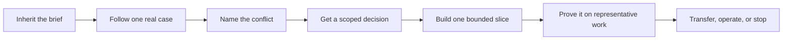

# The Applied AI Field Guide in Five Minutes

> The brief is probably wrong somewhere. Your first job is to find out where.

A common Monday starts like this: “Build an agent that clears invoice exceptions.” By 9:40, the analyst has shown you three queues, an unmentioned spreadsheet, and a controller-only policy check. The request described one workflow. The work has four.

Don't open the architecture diagram yet.

Whether you're on an internal AI team or a customer engagement, first find what is happening, what is worth changing, who has authority, and what would make the result acceptable. Then build the smallest intervention that can survive the real operation.

This page is guidance—not production approval, customer authority, or a substitute for the target organization's policy, security, architecture, and risk review.

## Start with what broke

You don't need to learn the repository before using it. Pick the line that sounds closest to today.

| What you walked into | Do this next | Leave the first pass with |
| --- | --- | --- |
| **The brief doesn't match the work** | Preserve what was promised or requested, then follow one recent case with the person who handled it. Use the [field-engagement playbook](../playbooks/00-field-engagement-and-reframing.md). | The inherited claim, the observed reality, and the next decision written separately |
| **Nobody can explain the whole process** | Find the process knower through recent exceptions, repairs, and handoffs—not the org chart. Start a [field-observation log](../templates/field-observation-log.md). | One named operator or owner and one representative case you can inspect |
| **The sponsor, operator, and policy disagree** | Cite each claim, name the safe fallback, and ask the actual disposition authority for a scoped decision. Use the [engagement-reframe record](../templates/engagement-reframe.json). | A bounded conflict, its evidence, and an accepted, rejected, or deferred reframe |
| **The team needs to prove a safe first slice** | Define one accepted outcome, its verifier, eligible work, exclusions, and maximum effect before selecting technology. Use [Discovery and Value](../playbooks/01-discovery-and-value.md), then [build one vertical slice](../playbooks/02-solution-and-delivery.md#5-build-a-vertical-slice). | A testable boundary and a reason this slice is worth running |
| **Something was built, but nobody will accept or own it** | Stop adding features. Check acceptance evidence, operating ownership, rollback, support, and transfer with [production readiness](../templates/production-service-readiness.md) and the [customer handoff](../templates/customer-enablement-handoff.md). | A named gap, owner, and decision to repair, constrain, transfer, pause, or retire |

Start with the closest row.

## Before you design anything

Find the person who knows the work because they do it, repair it, or get blamed when it goes wrong. Recent exceptions are a better trail than the org chart. Ask for one actual case. Watch the handoffs, judgment calls, policy checks, and quiet workarounds.

Keep evidence separate: what sponsors say, operators do, systems enforce, and policy authorizes. Inspect relevant code or configuration, data, permissions, and one representative execution. Questionnaires and maturity scores don't prove readiness.

Now write the conflict in plain English. For example:

> **Inherited brief:** the agent approves invoice exceptions automatically.
>
> **Observed:** four of the last twenty cases needed controller judgment, and the policy source changes outside the workflow tool.
>
> **Safe fallback:** prepare a cited recommendation; don't approve or post anything.
>
> **Decision needed:** whether to test that bounded review path for two weeks.

That note is often more useful than another discovery workshop. It gives the right person something concrete to accept, reject, narrow, or defer. Until that happens, preserve the original brief and don't quietly rewrite the project around your preferred solution.

This is a compressed field path, not the [canonical lifecycle](../README.md#from-idea-to-production).

## Once the boundary is real

Define what success means before choosing the mechanism. Name the eligible work, current baseline, intended outcome, accountable owner, and independent verifier. Add the decision deadline, full-cost ceiling, guardrails, and the conditions for continuing, reshaping, pausing, or stopping.

If nobody with authority can accept the outcome, you're still in discovery. That's inconvenient, but useful to know before the team spends six weeks polishing a demo.

Then split the workflow into actual decisions. A rule may handle eligibility. Retrieval may find the governing passage. A model may draft a comparison. A person may still own the judgment. Compare deterministic software, optimization, classical machine learning, retrieval, a bounded model call, an agent workflow, and human review where each is relevant. Use the simplest route that meets the need.

The model can propose. It can't grant itself permission or prove that an effect occurred. Trusted software has to enforce identity, tenant, scope, policy, approval, duplicate safety, and effect limits. For a consequential action, read the result back from the authoritative system before telling anyone it is done.

## Prove the service people will actually run

A tidy happy path isn't enough. Test normal work, awkward exceptions, stale sources, dependency failures, policy changes, retries, recovery, reviewer capacity, cost, and latency. Bind the result to the exact data, behavior, tools, software, and policy versions that ran.

Watch the human side too. Can the operator understand the evidence? Does review fit inside the working day? Are people correcting the system, bypassing it, or abandoning it? A model score won't answer those questions.

Before launch, use the [release gates](../operations/release-gates.md) to name the operating owner, telemetry, support route, rollback trigger, change process, and retirement conditions. A canary without somebody watching it is just a smaller unattended release.

## Make ownership survive the project

The people running the service need to operate, evaluate, change, release, recover, support, and retire it. Practice those jobs during the pilot. Don't wait until the last week to discover that only the original builder can change a rule or restore a failed job.

An internal team may keep ownership; give it capacity and backup coverage. A temporary FDE team should agree on exit evidence and transfer ordinary implementation or support once the important uncertainty is resolved. Neither arrangement should depend on one person's laptop or permanent availability.

Track eligible work through exposure, completion, acceptance, and effect. Fix the first break; don't assume training or exceed support capacity.

## Keep the working packet small

Don't fill every template. Create the evidence needed for the next consequential decision:

- an [observation log](../templates/field-observation-log.md) for what happened in the work;
- an [engagement reframe](../templates/engagement-reframe.json) when field evidence contradicts the brief;
- a [workflow charter](../templates/workflow-charter.json) and [value case](../templates/value-case.md) once the boundary is credible;
- an [intelligence-selection record](../templates/intelligence-selection-record.md) before committing to a mechanism;
- representative [evaluation cases](../templates/evaluation-case.json) before making a release claim;
- [production readiness](../templates/production-service-readiness.md) and [handoff evidence](../templates/customer-enablement-handoff.md) before launch or a change of owner.

If an artifact doesn't help someone make, verify, operate, or revisit a decision, you probably don't need it yet.

## Where to go next

Still reconciling the brief? Continue with [Field Engagement and Accountable Reframing](../playbooks/00-field-engagement-and-reframing.md). If the workflow boundary is accepted and you need the full mental model, read the [concise Applied AI Field Guide](README.md). If you're designing or reviewing the implementation, move into the [lifecycle playbooks](../playbooks/README.md) and [Engineering Kit](../examples/invoice-exception/README.md).

The Guide is a design and verification kit, not a runtime, certification, or universal compliance standard. Complete templates and teaching systems aren't customer evidence. Target-system policy, source authority, human decisions, and inspectable release evidence still control what may ship.
