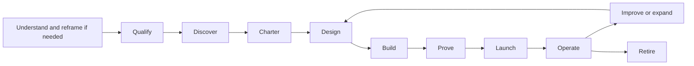

# Applied AI Delivery Playbooks

New to the method? Read the concise [Applied AI Field Guide](../guide/README.md) first. This Handbook starts where a team is ready to run a real engagement or internal delivery lifecycle.

Use these playbooks to move one workflow from an important problem to business-owned production operation. The requester may be a customer, product team, or internal sponsor. The same questions apply: who knows the work, who may change it, what evidence is needed, and who will keep the service running? Commercial acceptance and internal funding have different owners; neither replaces workflow or release authority.

## Lifecycle

This is an operational view of the [canonical delivery lifecycle](../README.md#from-idea-to-production), not a separate process. Preserve and inspect the initial request. Create a reframe record only when representative evidence materially contradicts its claims or boundary.

| Stage | Primary question | Required output | Decision |
| --- | --- | --- | --- |
| Understand and reframe if needed | What was requested, what actually happens, and who may change the boundary? | Preserved request, representative evidence, and next move; add an engagement-reframe record and safe fallback when a material contradiction changes the boundary | Continue discovery, bounded kickoff, defer, or stop |
| Qualify | Is this problem important, owned, bounded, and verifiable? | Candidate brief and gate result | Discover, defer, or do not build |
| Discover | How does the work actually happen, including exceptions and workarounds? | Observation log, current-state workflow, source map, exception set | Charter or stop |
| Charter | Which outcome, segment, verifier, value hypothesis, and risk ceiling define success? | [Workflow charter](../templates/workflow-charter.json) and [value case](../templates/value-case.md) | Pilot, defer, or do not build |
| Design | How do data, logic, actions, security, users, operations, and the selected intelligence mechanisms fit together? | Intelligence-selection record, domain model, target system design, agent-system when a foundation-model or agent workflow is selected, behavior bundle when model behavior is selected, applicable tool contracts and capability manifests, threat model, eval plan, and a system map only when dependency complexity warrants it | Build or redesign |
| Build | What is the smallest end-to-end slice that can prove the outcome? | Working vertical slice and delivery evidence | Continue or stop |
| Prove | Does it work on representative cases, with users, within risk and cost limits? | Replay, shadow, adoption, value evidence, and the applicable evaluation record; use the [evaluation report](../templates/evaluation-report.json) for a model/agent release | Canary, revise, or stop |
| Launch | Can the compatible solution be contained, recovered, supported, and rolled back? | Target software release record, runbooks, trained owners, and cutover decision; use the [solution-release manifest](../templates/solution-release.json) for a model/agent release | Bounded production or hold |
| Operate | Is the workflow valuable, reliable, safe, adopted, supportable, and still organizationally owned? | Service reviews, incidents, regressions, value realization, and continuation evidence | Expand, constrain, pause, or retire |
| Improve or expand | Which field learning warrants a workflow configuration, compatible product change, or bounded expansion? | [Field-learning register](../templates/field-learning-register.md) and validated disposition | Investigate, configure, fix, productize, standardize, defer, reject, or retire |
| Retire | When should the workflow stop, and how will authority, capabilities, state, evidence, support, and users be closed safely? | Owned [retirement sequence](03-operate-and-scale.md#10-run-the-improve-expand-or-retire-sequence) and verified target software retirement evidence; for a model/agent release, use [`solution-release.retirement_evidence`](../schemas/solution-release.schema.json) | Retire or remediate |

## Read in order

1. [Field engagement and accountable reframing](00-field-engagement-and-reframing.md)
2. [Discovery and value](01-discovery-and-value.md)
3. [Solution design and delivery](02-solution-and-delivery.md)
4. [Operate and scale](03-operate-and-scale.md)

The [production implementation playbook](../library/07-production-implementation-playbook.md) remains the detailed technical release sequence. These lifecycle playbooks connect it to field discovery, value, adoption, ownership, and reusable learning. Use the current stage rather than restarting discovery for an already evidenced decision.

## Minimum engagement packet

| Artifact | Purpose |
| --- | --- |
| [Field-observation log](../templates/field-observation-log.md) | Record actual work, evidence, exceptions, and workarounds |
| [Engagement-reframe record](../templates/engagement-reframe.json), when evidence materially contradicts the brief | Preserve competing claims, scoped disposition, chronology, safe fallback, and selective propagation; do not create a conflict for an otherwise valid brief |
| [Discovery pack](../templates/discovery-pack.md) | Map workflow, sources, decisions, exceptions, and readiness |
| [Workflow charter](../templates/workflow-charter.json) | Bind problem, scope, outcome, value, readiness, owners, and decision |
| [Value case](../templates/value-case.md) | Separate estimated, measured, and realized value |
| [Intelligence selection record](../templates/intelligence-selection-record.md) | Choose the smallest sufficient combination of rules, optimization, ML, retrieval, models, agents, and human review |
| [System map and change impact](../templates/system-map-manifest.json) and [assessment](../templates/change-impact-assessment.json) | Optional derived navigation and material-change evidence for complex, changing systems; never a substitute for authority or release evidence |
| [Delivery and adoption plan](../templates/delivery-and-adoption-plan.md) | Coordinate the vertical slice, acceptance, rollout, and enablement |
| [Production handoff](../templates/customer-enablement-handoff.md) | Prove the accountable operating team can operate, change, support, and retire the service |
| [Production service review](../templates/production-service-review.md) | Review decision rights, outcomes, SLOs, adoption, risk, cost, change, and receiving-team ownership |
| [Workflow portfolio review](../templates/workflow-portfolio-review.md) | Map company decision rights and shared-versus-workflow capabilities; compare stage flow, proof gates, accepted value, economics, reuse, and capacity without overriding service gates |
| [Field-learning register](../templates/field-learning-register.md) | Route validated field evidence into local configuration, product change, shared pattern, or retirement |

Controls `FDE-001` through `FDE-005`, `VAL-001` through `VAL-003`, `ADP-001` through `ADP-002`, and `DEL-001` through `DEL-002` define the lifecycle baseline within this guide.
