# The FDE Guide

> **Field discovery, accountable adaptation, value engineering, and production architecture for real-world AI delivery**


An independent, open-source guide for forward-deployed engineers, applied-AI teams, and operators who need to turn messy work into an accepted, operated outcome.

[](https://github.com/davidahmann/fde-guide/actions/workflows/validate.yml)
[](https://github.com/davidahmann/fde-guide/releases/latest)
[](LICENSE)

[Five-minute field guide](guide/fde-guide-in-five-minutes.md) · [Complete method](guide/README.md) · [One worked engagement](examples/invoice-exception/engagement/README.md) · [12 Factors of AI Value Engineering](library/14-twelve-factors-ai-value-engineering.md) · [Executive funding guide](guide/funding-ai-for-accepted-outcomes.md)

## Start with what went wrong

Pick the situation in front of you. You don't need to learn the repository first.

| What happened | Start here | Leave with |
| --- | --- | --- |
| **The brief doesn't match the real workflow** | [Field engagement and reframing](playbooks/00-field-engagement-and-reframing.md) | One representative case, conflicting claims, a safe fallback, and the person who may decide |
| **Nobody can identify the real process owner or expert** | [Find the process knower](playbooks/00-field-engagement-and-reframing.md#find-the-process-knower) and open an [observation log](templates/field-observation-log.md) | A named operator or owner and a recent exception followed end to end |
| **The sponsor, operator, and policy disagree** | [Bound the conflict](playbooks/00-field-engagement-and-reframing.md#5-bound-the-conflict) and use the [reframe record](templates/engagement-reframe.json) | Cited evidence and an accepted, rejected, or deferred reframe |
| **The team needs to prove one safe slice** | [Discovery and Value](playbooks/01-discovery-and-value.md), then [build one vertical slice](playbooks/02-solution-and-delivery.md#5-build-a-vertical-slice) | An accepted outcome, verifier, exclusions, maximum effect, and test cases |
| **Something was built, but acceptance or ownership is stuck** | [Production readiness](templates/production-service-readiness.md) and [customer handoff](templates/customer-enablement-handoff.md) | The missing evidence or capability, its owner, and a repair, transfer, pause, or retirement decision |

## Choose your depth

| Layer | Use it for | Entry |
| --- | --- | --- |
| **The Guide** | The mental model and canonical delivery loop | [Five-minute Guide](guide/fde-guide-in-five-minutes.md), then [concise Guide](guide/README.md) |
| **Handbook** | Running a live engagement | [Lifecycle playbooks](playbooks/README.md) |
| **Engineering Kit** | Contracts, controls, architecture, evaluations, operations, and executable evidence | [Templates](templates/README.md), [controls](controls/control-catalog.json), and [examples](examples/invoice-exception/README.md) |

They are not separate frameworks. Start shallow; follow a link only when the next decision requires it. The [capability roadmap](guide/capability-roadmap.md) is a learning route, not a certification.

## The core idea

Start with the work and the accepted outcome, not a model or agent topology. Compare deterministic software, optimization, classical ML, retrieval, a foundation-model call, a bounded agent workflow, and human review. Choose the smallest mechanism that can safely do the job.

> **Tokens are an input. Autonomy is a design choice. Accepted outcomes are the product.**

The [12 Factors of AI Value Engineering](library/14-twelve-factors-ai-value-engineering.md) make outcome, verifier, adoption, authority, cost, proof, and lifecycle gates explicit. Use the [one-page scorecard](guide/ai-value-engineering-scorecard.md) for a live decision. If you're deciding whether to release more money or time, use the [executive funding route](guide/funding-ai-for-accepted-outcomes.md).

## See it working

The [invoice-exception engagement](examples/invoice-exception/engagement/README.md) follows a sold promise that field evidence kills. It connects the reframe, worked economics, mechanism choice, controlled-write runtime, evaluation, adoption plan, blocked handoff, and review-only decision. Inspect the [runtime](examples/invoice-exception/reference-loop.mjs) and its adversarial tests.

The [shipment-risk example](examples/shipment-risk-triage/README.md) combines classical ML, deterministic routing, optional model explanation, and human review without pretending every workflow needs an agent.

```bash
npm ci --ignore-scripts
npm run test:reference
npm run test:evals
npm run test:hybrid
```

These are in-memory teaching systems. Passing tests proves only the declared local behavior—not customer value, production readiness, or deployment approval.

Before adapting either one, use [Enterprise Integration and Scale Reality](library/17-enterprise-integration-and-scale-reality.md) to replace teaching conveniences with target evidence for sources, identity, state, audit, reconciliation, load, and recovery.

## Who this is for

| You need to | Use |
| --- | --- |
| Fix an inherited brief or field contradiction | [Five-minute Guide](guide/fde-guide-in-five-minutes.md) and [reframing playbook](playbooks/00-field-engagement-and-reframing.md) |
| Decide whether the workflow is worth funding | [Executive funding guide](guide/funding-ai-for-accepted-outcomes.md) and [12 Factors worksheet](guide/ai-value-engineering-scorecard.md) |
| Deliver or operate the change | [Handbook](playbooks/README.md) and the current lifecycle stage |
| Design or review the system | [Engineering Kit](templates/README.md), [blueprints](blueprints/README.md), and [production controls](controls/control-catalog.json) |
| Learn or assess the practice | [Capability roadmap](guide/capability-roadmap.md) and one bounded mission |

## From idea to production

This is the one canonical lifecycle. Shorter diagrams elsewhere are labeled field or capability views.

```mermaid
flowchart LR
    A["Inherit the brief"] --> B["Observe and reconcile the work"]
    B --> C["Charter value and scope"]
    C --> D["Make data fit for the decision"]
    D --> E["Select the mechanism"]
    E --> F["Build one controlled slice"]
    F --> G["Prove it with cases and users"]
    G --> H["Launch and transfer ownership"]
    H --> I["Operate, learn, or retire"]
```



Each transition needs inspectable evidence and an accountable decision. A model score, sponsor, deadline, or renewal cannot average away a failed value, authority, safety, ownership, or production gate. Follow the [complete method](guide/README.md) or read the [worked invoice chain](examples/invoice-exception/engagement/README.md).

Validate a working artifact before it is complete:

```bash
npm run validate:artifact -- ./path/to/workflow-start.json --profile starter --type workflow-charter
npm run validate:artifact -- ./path/to/workflow-charter.json --profile complete
```

The starter profile checks the few fields needed for the current decision while retaining the same canonical types and closed-object rules. It is not a second schema. See [artifact validation](templates/README.md#validate-as-the-decision-matures).

## Start from a business flow

After workflow and value are accepted, choose a [business-flow pattern](solutions/business-flows/README.md) and, when material, an [industry profile](solutions/verticals/README.md). Add only needed foundations. The [solution portfolio](solutions/README.md) remains a design hypothesis, not evidence or a deployable product.

## Optional: use it with a coding agent

The guide is complete as documentation. Sixteen optional skills provide focused routes over the same canonical artifacts:

```bash
npx skills add davidahmann/fde-guide
```

Pin the source. Skills grant no authority or evidence. Give an agent [AGENTS.md](AGENTS.md).

The private [FDE local plugin](plugins/fde/README.md) adds offline continuity for sources, revisions, decisions, dependencies, and review packets. Keep restricted content in the customer system.

Describe the situation; don't translate it into repository taxonomy first:

| Say this | Intended route |
| --- | --- |
| “Keep this engagement coherent and tell me the next defensible move.” | [`$run-fde-engagement`](.agents/skills/run-fde-engagement/SKILL.md) |
| “The brief is wrong, and sponsor and operator disagree.” | [`$reframe-ai-engagement`](.agents/skills/reframe-ai-engagement/SKILL.md) |
| “We bounded the workflow. Is it worth funding?” | [`$engineer-ai-value`](.agents/skills/engineer-ai-value/SKILL.md) |
| “This exact release is ready for a production decision.” | [`$review-ai-production-readiness`](.agents/skills/review-ai-production-readiness/SKILL.md) |
| “The service is live; decide what to improve, constrain, or retire.” | [`$operate-ai-service`](.agents/skills/operate-ai-service/SKILL.md) |

These cues don't prove host routing. Confirm the skill.

## Scope and contribution

The control catalog is project policy, not an external compliance standard. Target organizations retain architecture, risk, and release authority.

Contributions should improve an existing route before adding another one. See [CONTRIBUTING.md](CONTRIBUTING.md), [repository maintenance](docs/maintainers/repository-maintenance.md), [security policy](SECURITY.md), and the [Apache-2.0 license](LICENSE).
